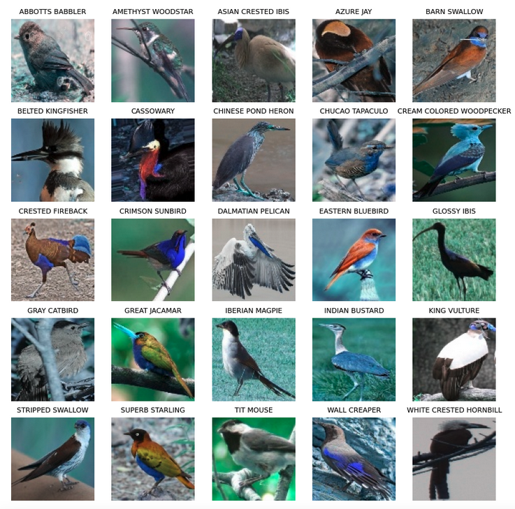

# CS 167 Project 2: 

## Project Description: 🎥 🍿
For this project, you should use this [_Bird Species dataset_](https://analytics.drake.edu/~reza/teaching/cs167_fall23/dataset/bird_species_v1.zip). This dataset can also be found on Blackboard for CS167. While in class, we focused on basic-level categorization, such as binary classification of dogs vs. cats or multi-class classification of bikes, cats, dogs, and persons. In this project, our interest lies in a more __fine-grained visual categorization (FGVC)__ of a biological domain ie, _birds_. This field has a well-studied taxonomy and offers valuable ecological applications. You should use the provided Bird Species dataset to train a deep neural network model, enabling it to predict the specific species of a bird when provided with any future image. Imagine how cool it would be if you could deploy this model to an iPhone or an Android app, allowing people worldwide to use it while hiking or exploring the Amazon rainforest.

## Project 2 Notebook:
You should use this [_Project_2_starter notebook_](https://github.com/alimoorreza/CS167-Project-2/blob/main/Project2_starter.ipynb). It contains the most crucial part, i.e., the code for three CNNs: AlexNet, VGGNet, and ResNet. For other machine learning functions, you can borrow them from previous notebooks, such as [Day24: CNN finetuning](https://github.com/alimoorreza/CS167-notes/blob/main/Day24_CNN_finetuning.ipynb).

## Learning Objectives: 📝
For this project, you will be fine-tuning pretrained convolutional neural networks (CNNs) for fine-grained categorization of bird species. As a machine learning tool, you will use the PyTorch and scikit-learn libraries to conduct a machine learning experiment, and your write-up will require you to explain what you did and interpret the results. This directly addresses three of the course learning objectives stated in the syllabus:
- Students will be able to create software that utilizes machine learning programming libraries for conducting machine-learning-based data analysis.
- Students will be able to develop and conduct machine-learning-based data analysis experiments, and they will be able to interpret and explain the results.
- Students will receive hands-on experience with commonly used algorithms (eg, CNNs such as AlexNet, VGGNet, ResNet, optimizers such SGD, ADAM) and software tools (PyTorch, sklearn) within machine learning.

## Project Expectations: ☑️
At the very top of your notebook, add a text cell, then describe how many points you attempted to earn from this project. Tell me what you think you deserve on this notebook given the rubric at the bottom of this page.

You need to create a Colab notebook starting from here [_Project_2_starter notebook_](https://github.com/alimoorreza/CS167-Project-2/blob/main/Project2_starter.ipynb), then add your code and results to document your experiment. Most importantly, you will use text cells in the notebook to explain what you did, interpret the results, and make your recommendations. The written markdown protions must include the following things:
1. **Problem** [1 point]: State the problem you are trying to solve with this machine learning experiment. Include a description of the data, and what you're trying to predict. What are the possible uses for this kind of machine learning model? Can this type of model be used for fine-grain categorization of any other domains such as biological, industrial, and personal.
2. **Explore the Data** [5 points]: Find the values for the following metrics: 
    - __Total number of samples__: total number of examples you have in the dataset
    - __Total number of training samples__: total number of examples you have in the training split of the dataset
    - __Total number of testing samples__: total number of examples you have in the testing split of the dataset
    - __Number of classes__: total number of categories in the dataset
    - __Dimension of each data sample__: Find the size of a sample image in the dataset (use the function `.shape`. Refer to the  [_Project_2_starter notebook which has sufficient hints_.](https://github.com/alimoorreza/CS167-Project-2/blob/main/Project2_starter.ipynb)).
    
3.  **Data Preparation** [1 point]: Explain your data preparation. What steps did you have to take to prepare your data for experiments, such as normalization, etc.? Which PyTorch function is responsible for performing the normalization? Just mention the name.
4.  **Metrics** [1 point]: What metrics will you use to evaluate your model? Why are these metrics the best for your model? (Hint, this should be more than 'accuracy').
5.  **Model Planning and Execution** [1 point]: Identify which learning algorithms you will try and which important parameters you will tune for each one. [Hint: you can find it from previous notebooks, such as [Day24: CNN finetuning](https://github.com/alimoorreza/CS167-notes/blob/main/Day24_CNN_finetuning.ipynb).]
6.  **Bumps in the Road** [1 point]: What challenges did you encounter? How did you overcome these challenges? Did you have to adapt your strategy to account for these challenges? Why or why not?
7.  **Results** [3 point]: After you conduct your learning experiment, summarize the results you got. Include visualizations as appropriate. More explicitly, you should fill in the following table:

| **Model**                        |**Best epoch** |**Best performance** |**Best optimizer** 
| :------------------------------- | ------------: | ------------: | ------------: |
| 1: AlexNet                       |               |               |               |
| 2: VGGNet                        |               |               |               |
| 3: ResNet                        |               |               |               |

8.  **Conclusions** [1 point]: What insights/recommendations do you have? What did you find that was interesting? Which model was your best model? Why do you think models are giving excellent results from the first epoch? Do you need too many epochs to find your best? Why or why not? In general, I want a discussion of your experiment, the results, and what they mean.

### Your Experiments should demonstrate the following well-established and effective convolutional neural networks (CNNs):
- **AlexNet**
- **VGGNet**
- **ResNet**

📉 📊 📈 💹 You also should include at least **3 visualizations (graphs)** of tuning parameters eg, _loss curves_, _accuracy curves_, _confusion matrices_.

## Extra Credit ✨
You will have an opportunity to earn extra credit on this project, up to 2 points. 
- First, you need to save the best model for a specific epoch for each of the three models (_AlexNet, VGGNet, and ResNet_) separately. (Hint: we did save a trained model with _.pth extension_ in [Day 25's Notes](https://github.com/alimoorreza/CS167-notes/blob/main/Day25_Recurrent_Neural_Network_RNN.ipynb)).
- Secondly, you need to present the confusion matrix on the test split utilizing the best-performing model. To be precise, there will be three confusion matrices, each corresponding to the best-performing model from _AlexNet, VGGNet, and ResNet_.

# Rubric and Grading
Project #2 will be graded using the following rubric. I strongly suggest evaluating your project using this rubric before turning it in.
It consists of two criteria: 1) Description/Writing (12 points), and 2) Code (7 points). The details of the rubrics are as follows:

| **Description/Writing**          |**I think I deserve:**   |**Actual Grade**|**Notes** |
| :------------------------------- | -------: | ----: |:---- |
| 1: Problem                       |        /1|       /1|    |
| 2: Explore the Data              |        /5|       /5|    | 
| 3: Data Prep                     |        /1|       /1|    |
| 4: Metrics                       |        /1|       /1|    | 
| 5: Model Planning and Execution  |        /1|       /1|    |
| 6: Bumps in the Road.            |        /1|       /1|    |
| 7: Results                       |        /3|       /3|    | 
| 8: Discussion/Conclusion.        |        /1|       /1|    |
| <b>Total                         |       /14 |     /14 </b>   |

| **Code**                         |**I think I deserve:**|**Actual Grade**    |**Notes** |
| :------------------------------- | -------: |-------: | :----    |
| 1: AlexNet                       |        /1|        /1|         |
| 2: VGGNet                        |        /1|        /1|         | 
| 3: ResNet                        |        /1|        /1|         |
| 4: 3 Visualizations              |        /3|        /3|         | 
| <b>Total                         |        /6 |       /6|</b>     |

| **Extra Credit**                                         |**I think I deserve:**|**Actual Grade**     |**Notes** |
| :-------------------------------                         | -------:             | ----:               |:----     |
| Saving best fine-tuned model                             |                    /1|                   /1|          |
| Performance evaluation using the best fine-tuned model   |                    /1|                   /1|          |

| **Written Portion** 📝 | **Code Portion** 🖥️ | **Extra Credit** ✨  |**Total** ➕ |**Notes** 🗒️|
| ---------: | -------------------: | ------------: |-------------: |---------- |
|       /14  |                  /6 |           /0 |         /20|           |

